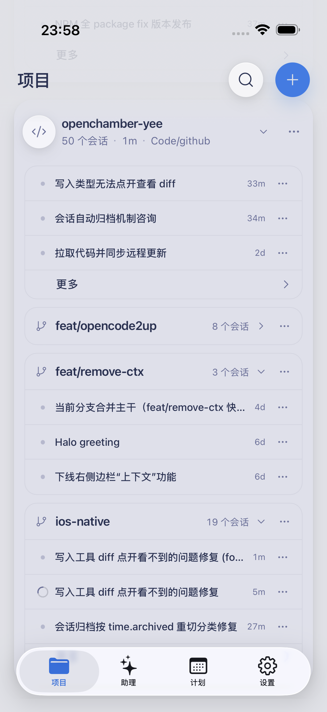
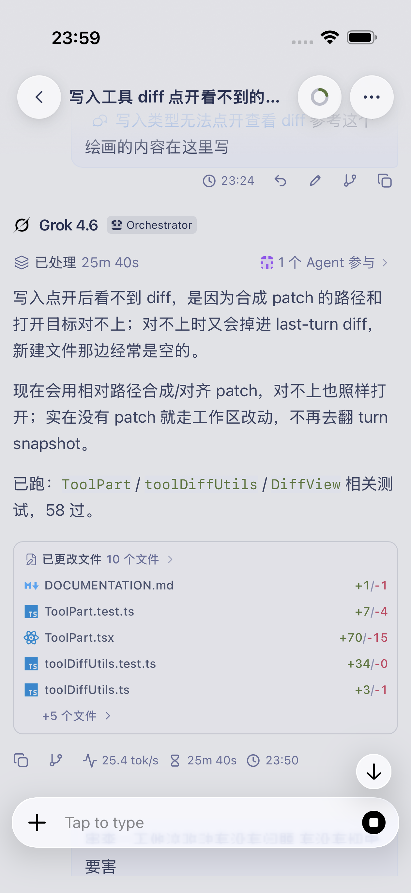
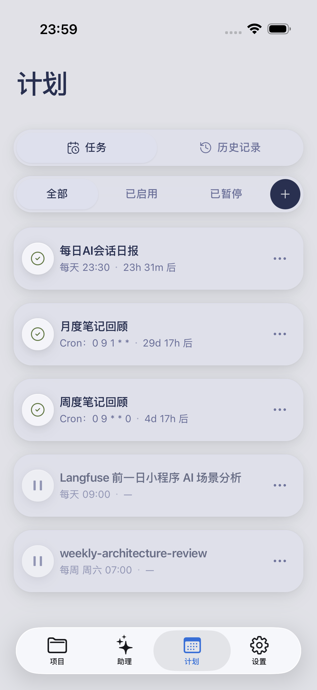

# <picture><source media="(prefers-color-scheme: dark)" srcset="docs/references/badges/openchamber-logo-dark.svg"></picture> OpenChamberY

[](https://github.com/yee94/openchamber/stargazers)
[](https://github.com/yee94/openchamber/releases/latest)
[](https://opencode.ai)

**The full-surface GUI and mission control for [OpenCode](https://opencode.ai).**

Desktop · Mobile · Browser · VS Code

[中文说明](./README_ZH.md)

<p align="center">
  
</p>

<table align="center" border="0" cellspacing="0" cellpadding="4">
  <tr>
    <td width="33.3%" valign="top">
      
    </td>
    <td width="33.3%" valign="top">
      
    </td>
    <td width="33.3%" valign="top">
      
    </td>
  </tr>
</table>

---

## About OpenChamberY

**OpenChamberY** is maintained by [@yee94](https://github.com/yee94), forked from the upstream open-source project [fedaykindev/openchamber](https://github.com/fedaykindev/openchamber) by Bohdan Triapitsyn.

Building upon the upstream cross-surface architecture and [OpenCode](https://opencode.ai) runtime engine, OpenChamberY focuses on:
- **Codex-grade desktop flow**: `Ctrl+X` leader shortcuts, double-`Esc` abort, `/fork` session branching, and keyboard-first operations.
- **Deep native mobile experience**: iOS Live Activities & Dynamic Island, refined haptics, native composer, and system share integration.
- **Scheduled automations & Goal mode**: Built-in Cron scheduler for recurring codebase health audits, standup digests, and autonomous tasks.
- **Reliability & cross-device sync**: SQLite session indexing, coalesced cold-start queries, and resilient synchronization.

---

## Features

### 1. Chat & Interaction
- **Codex-grade keyboard flow**: `Ctrl+X` leader chords, double-`Esc` abort, `/fork`, `/compact`, and `Ctrl+C` input clear.
- **Branchable session tree**: Fork sessions anytime from earlier turns, explore alternative paths, and navigate past timelines with `/undo` and `/redo`.
- **Smart tool UI**: Live visual diff cards, file operations, permission prompts, and long-running task progress (with real-time tok/s).
- **Plan / Build mode**: Dedicated plan drafting view; add inline comments on diffs and plans to feed back to the agent.
- **Parallel subagents & worktrees**: Spawn child agents running inside isolated Git worktrees without touching your active branch.
- **Voice mode & diagrams**: Speech input and read-aloud responses; embedded Mermaid diagram rendering.

### 2. Git & GitHub Workflows
- **Full Git sidebar**: Staging, commits, push/pull, branch management, rebase, and merge flows.
- **Automated PR workflows**: AI-generated PR descriptions, integrated CI status checks, and in-app merging.
- **Issue & PR context**: Start dedicated sessions directly from GitHub issues or pull requests with context pre-attached.

### 3. Files, Diff & Integrated Terminal
- **Interactive diff viewer**: Stacked and inline views, lazy loading for large changesets, and one-click file jump.
- **Workspace file tree**: Built-in editor with syntax highlighting, Vim mode, and live Markdown preview.
- **High-performance terminal**: Powered by the Ghostty engine with multi-tab support and stability under heavy output.

### 4. Native Mobile Experience (iOS / Android / PWA)
- **iOS Live Activities & Dynamic Island**: Track active tasks, runtime, and attention prompts without keeping the app open.
- **Refined touch & native composer**: Elastic press feedback, light haptics, and a mobile-optimized input experience.
- **System share integration**: Share links, text snippets, and images from any mobile app directly into OpenChamberY assistants.
- **Push alerts**: Remote notifications supported via APNs and self-hosted Push Relay.

### 5. Scheduled Tasks & Automations
- **Built-in Cron / recurring schedules**: Trigger runs daily, weekly, or via custom Cron expressions.
- **Goal Mode**: Hand off high-level prompts that agents pursue autonomously until done, with complete run logs.
- **Common use cases**: Daily codebase morning digests, periodic dependency audits, and weekly architecture reviews.

### 6. Multi-Surface & Connectivity
- **One-tap QR pairing**: Scan from the mobile app to pair devices instantly with isolated authorization tokens.
- **Private Relay**: End-to-end encrypted remote access without opening router ports or exposing public IPs.
- **Desktop extras**: Floating Mini Chat, multi-window workspace, and SSH remote instance management with port forwarding.
- **VS Code Extension**: Run full sessions directly in your editor sidebar with Agent Manager and context menus.

### 7. Customization & Insights
- **18+ built-in themes**: Light and dark variants with hot-reloading for custom JSON themes.
- **Token usage & cost metrics**: Real-time token breakdowns across providers, run pacing, and raw message inspector.
- **Project notes & skills**: Persistent workspace Notes and Todos, plus built-in Skills catalog and management.

---

## Downloads

| Platform | Installation |
|---|---|
| **Desktop** (macOS / Windows / Linux) | [GitHub Releases](https://github.com/yee94/openchamber/releases) |
| **iOS** (TestFlight) | [Join Public Beta](https://testflight.apple.com/join/ZCENBHtm) (requires TestFlight on device) |
| **Android** | [GitHub Releases](https://github.com/yee94/openchamber/releases/latest) (`app-release.apk`) |
| **VS Code** | Search `OpenChamber` in Extensions or install from [Marketplace](https://marketplace.visualstudio.com/items?itemName=fedaykindev.openchamber) |
| **Web / CLI** | Install via `openchambery` script (see below) |

---

## Quick Start

> Desktop bundles a matching OpenCode CLI. Web/CLI and VS Code use your locally installed [OpenCode](https://opencode.ai).

### Web / CLI Server

Requires Node.js 22+:

```bash
curl -fsSL https://raw.githubusercontent.com/yee94/openchamber/main/scripts/install.sh | bash
openchambery --ui-password your-secure-password
```

Open `http://localhost:3000`. Under Settings → Remote Instances, generate a QR code to pair your mobile app.

<details>
<summary>Common openchambery CLI commands</summary>

```bash
openchambery --port 8080              # Custom port
openchambery --lan --port 3000        # Listen on LAN (0.0.0.0)
openchambery --ui-password secret     # Require UI password
openchambery startup enable           # Enable auto-start service on boot
openchambery connect-url --port 3000 --qr # Print pairing QR in terminal
openchambery stop                     # Stop background service
openchambery update                   # Update to latest version
```

</details>

<details>
<summary>Docker</summary>

```bash
docker compose up -d
```

Available at `http://localhost:3000`. Set `UI_PASSWORD` in your environment.

</details>

---

## Attribution

| Role | Details |
|---|---|
| **This fork** | Maintained by [yee94](https://github.com/yee94) (Yee) — Codex interaction parity, mobile UX, session reliability, and multi-surface polish |
| **Upstream OpenChamber** | [Bohdan Triapitsyn / fedaykindev](https://github.com/fedaykindev/openchamber) — original architecture & foundational product |
| **Runtime Engine** | [OpenCode](https://opencode.ai) — open-source AI agent runtime & SDK |

Independent community project; not affiliated with the OpenCode team.

## License

[MIT](./LICENSE)
