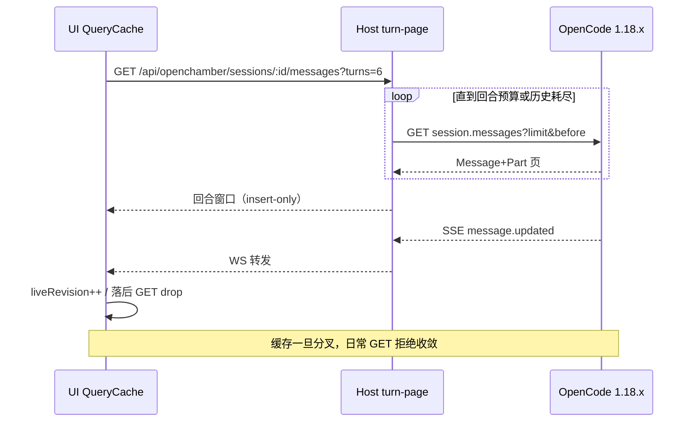
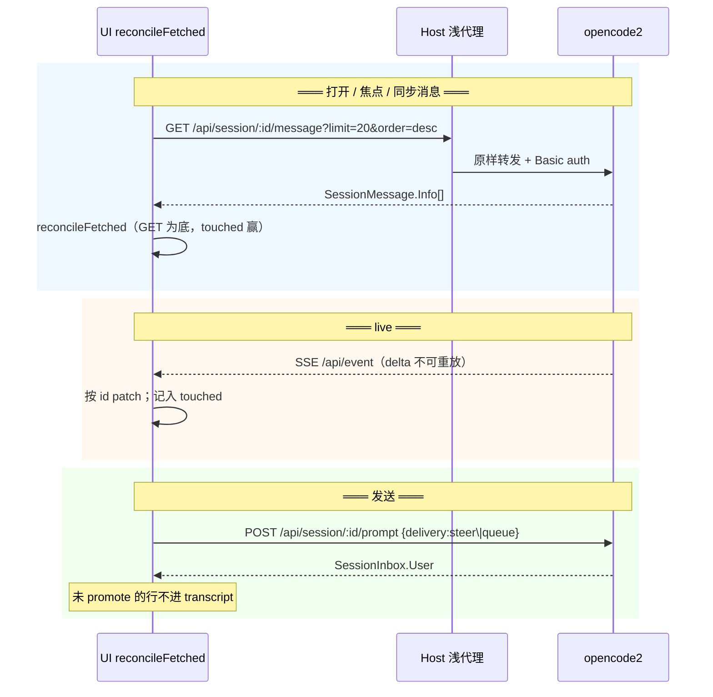
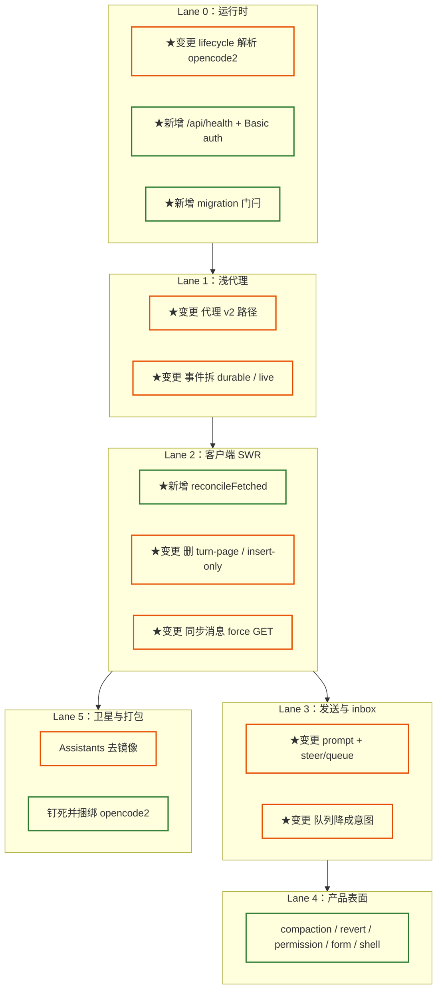

# OpenCode 2 升级方案

> 正文只存在 OpenCode。Host 做浅代理。客户端只留一层投影 SWR。

对照源：本地 `~/code/github/opencode` HEAD `1288161528`、官方 [V2 docs](https://opencode.ai/v2/docs)、[migrate-v1](https://opencode.ai/v2/docs/migrate-v1)、[API](https://opencode.ai/v2/docs/api)。上游 `openchamber/openchamber` 目前没有实施分支，只有 [#2810](https://github.com/openchamber/openchamber/issues/2810)。

## 一、结论

这次不是在 1.18.x 上再修一层合并。托管进程换成真正的 `opencode2`，消息存储和投影交给它，OpenChamber 拆掉自己叠上去的正文中间层。

推荐方案：

1. **运行时**：解析并托管 `opencode2` sidecar（`serve --hostname/--port`，或对齐官方桌面的 `--service`）。认 `server listening`、`GET /api/health`、Basic auth（用户名固定 `opencode`）。指向 1.x `opencode` 失败闭合。开机读 `GET /api/experimental/migration/v1`，完成前不当 transcript 已就绪。
2. **权威源**：OpenCode 的 `session_message` 投影是正文唯一权威。客户端打开 / 焦点 / 「同步消息」走 `GET /api/session/:id/message`。合并法抄官方 GUI 的 `reconcileFetched`：GET 是页权威，飞行中 SSE 改过的 id 为 touched 覆盖本次 GET，不完整页保留更早本地行。
3. **Host**：鉴权、directory/location 路由、Basic auth 注入、HTTP/SSE/WS 桥。不再拼回合、不再镜像 parts、不再自研 reconcile。
4. **不长期双栈**。切过去只认 v2。`@opencode-ai/sdk/v2`（1.18.4 生成客户端）不能当 v2 权威源，要换成 `@opencode/client`。
5. **不要赌 `session.log` 补历史**。默认 `opencode serve` 的 `events.persist=false`，EventTable 是空的，log 只有 `log.synced` 再切 live。断线对齐靠 GET 投影，不靠事件回放。
6. **不要 in-process `ServerFetch.make`**。官方 desktop 也是 sidecar + localhost HTTP。OpenChamber 继续这条路。

上游 [#884 backend-agnostic-harness](https://github.com/openchamber/openchamber/pull/884) 是 Codex 适配，不是 v2 浅代理。不要把它当本方案的实现底稿。

## 二、范围与非目标

### 2.1 做

- 托管 / 外部 host 全部切到 `opencode2`。
- 会话、消息、发送、事件、权限、问题、compaction、revert、inbox 走 v2 API。
- 删 Host `session-turn-pages`、`.../messages/reconcile`、Assistants 正文镜像。
- 客户端 transcript 收成投影 SWR + live overlay。
- 队列降成意图调度，投递后正文以 OpenCode 为准。
- 用 v2 产品能力替换我们现在用中间层补的体验：inbox、compaction、undo/redo、agent/model 切换消息、permission saved、forms、shell 消息。

### 2.2 不做

- 不在 1.18.4 上继续加 insert-only / liveRevision 补丁当长期方案。
- 不把 `@opencode-ai/server` import 进 Host 当库。
- 不复用用户已经在跑的 `opencode2 service`。
- 不把设置、配对、Relay、项目注册、session folders、goals、输入草稿迁进 OpenCode。
- 不等待上游 OpenChamber 先做 v2。
- 不把 v2 尚未交付的 session sharing 当成可依赖能力。
- 不默认打开 session warming（会打真实模型请求、烧钱）。

### 2.3 硬约束

- 钉死 OpenCode 版本为官方 `@opencode/cli@2.0.12`（client `@opencode/client@2.0.12`）。正式 CLI 名是 `opencode`（`opencode2` 只是别名）。本机管理进程不使用 Electron extraResource：优先复用全局已装的 v2，没有才把官方平台包装到 `~/.config/openchamber/opencode-cli/<pin>/opencode`。启动时复用已在 4096 上的健康 `opencode serve`，否则自己 `serve`。
- 官方故意打破的只有三块：plugin API、server API、TUI `tui.json` → `cli.json`。配置和 `.opencode/` 尽量兼容，但 **V1 subtask 不会投影进 v2**，要进行中的 tool 会变成 `tool.interrupted`。
- Web / Electron / VS Code / mobile / Relay 一次换契约。
- 不新增依赖，除非本方案进入实施并明确批准 `@opencode/client`。

## 三、当前链路

### 3.1 现状

今天正文有三层「权威」：

```text
UI QueryCache（InfiniteData + insert-only + liveRevision）
    ↑ HTTP turn-page / reconcile          ↑ SSE message.updated
Host session-turn-pages + assistants.sqlite 镜像
    ↑ 循环 1.x session.messages
OpenCode 1.18.x（真正权威，但被中间层挡住）
```

关键路径：

| 层 | 路径 | 在干什么 |
|---|---|---|
| Host 回合页 | `packages/web/server/lib/session-turn-pages/` | 循环上游页，切用户回合，自研 `ocr2` reconcile |
| UI 合并 | `session-merge-strategy.ts` / `transcript-merge.ts` | `initial`/`prepend`/`materialize` = insert-only |
| 热缓存 | `fetchMessagesForSession` / `ensureInitial` | 有用户边界就不再 GET |
| prepend | `transcript-merge.ts` L328 | 仍用 `message.id < previousFirst` |
| Assistants | `packages/web/server/lib/assistants/service.js` | `assistant_message_mirror` 再存一份正文 |
| 队列 | `message-queue.sqlite` | 存 parts，再用 `findMessage` 对账 |
| 拉起 | `lifecycle.js` | `spawn(opencode, ['serve'])`，探 `/global/health` |
| 二进制 | `env-runtime.js` | 只找 `opencode`，发现不了 `opencode2` |

132 已经修对的是：id 不是名次；SSE / optimistic 按 identity 定位；后台 idle 切回来要结算。那是「写错位置」，不是「和 OpenCode 对不上」。

### 3.2 现状时序



这个流程能挡住落后快照打掉最后一轮，代价是服务器改过的同一条消息正文刷新不进来。文档自己写了这条限制：`packages/ui/src/sync/DOCUMENTATION.md` L639。

### 3.3 痛点

| 痛点 | 事实 |
|---|---|
| **三层正文** | OpenCode SQLite、Host turn-page / assistants 镜像、客户端 QueryCache 各持一份 |
| **insert-only 不收敛** | `initial` 不能更新已有行；热缓存 `ensureInitial` 空转已被测试锁死 |
| **1.x 分页缺陷** | 按条数不是按回合；cursor 不能当稳定边界；Host 用 20 页 / 5 MiB 预算硬补 |
| **id 字典序残留** | prepend 仍用 `message.id < previousFirst`，和 131「id ≠ 名次」冲突 |
| **刷新按钮空** | 移动端三点、桌面会话菜单已接 `refreshSessionTranscript`，但热缓存 + insert-only 时帮不上 |
| **队列/Assistants 当正文库** | 跨 session 时间线、投递对账都在本地扫消息 |
| **运行时认错二进制** | PATH 上的 `opencode` 仍是 1.18.18；`opencode2` 已装但 Host 找不到 |

## 四、目标架构

### 4.1 目标链路

```text
UI SWR（GET 投影页 + live overlay + optimistic + force refresh）
    ↓ HTTP / SSE（Basic opencode:<password>）
Host 浅代理（鉴权、location、桥、不读 body）
    ↓
opencode2 sidecar（session_message 投影 + inbox + compaction + revert）
```



**核心原则**：

- GET 投影页是这一页的权威。SSE 只做增量。
- 飞行中改过的 id，本地比这次 GET 新，touched 覆盖，不要整页 drop。
- 完整尾页以 GET 的 id 集合为准：多的删、少的补、同 id 更新。
- 失败保留旧 transcript，不当成空成功。
- Host 可以转发，不可以解释 message body。

### 4.2 官方 GUI 实际怎么做

`packages/app/src/context/server-session.ts` 的 `reconcileFetched`：

- 首屏 `GET /api/session/:id/message?limit=20&order=desc`
- 历史用 cursor 翻页（上限 200）
- 请求期间事件改过的 id = touched，合并时以 live 为准
- 会话消息不进 React Query；全局/目录级数据才用 TanStack Query
- 视图把 `SessionMessage.Info` normalize 回旧 `Message + Part` 再画

我们不必换 Solid。保留 React + TanStack Query 当页缓存，合并法换成这一套。视图继续 normalize，避免一次重写全部渲染。

### 4.3 存储退场

| 当前结构 | 策略 | 说明 |
|---|---|---|
| OpenCode 1.x session/message/part | 开机跑 V1→V2 回填 | 复用 message id；按 `time_created, id` 赋 seq；不投影 V1 subtask |
| Host turn-page / reconcile | 删 | v2 直接读投影 |
| `assistants.sqlite` 正文镜像 | 停写正文 | 只留 binding / operation |
| `message-queue.sqlite` parts | 降成意图 | 投递后以 inbox / 投影为准 |
| `session-index.sqlite` | 留摘要缓存 | 可改读 `GET /api/session` |
| 客户端 QueryCache | 收成 SWR | 不再 insert-only |
| 设置 / 配对 / Relay / folders / 草稿 | 留 | 本来就不是 OpenCode 的权威 |

## 五、OpenCode 2 能力盘点

按「我们怎么用」分组，不是按官方目录抄一遍。

### 5.1 必须接（换代才能活）

| 能力 | API / 事件 | 对我们的含义 |
|---|---|---|
| Health + 密码 | `GET /api/health`；Basic `opencode:<password>`；stdout `server password` / `OPENCODE_PASSWORD` | Lane 0 门闩。旧 `/global/health` 只作探测回退，不能当主路径 |
| V1 迁移 | `GET /api/experimental/migration/v1`（`required/running/completed/error`） | 完成后才放行 session 消息。回填是后台自动跑，客户端只读状态 |
| 消息投影 | `GET /api/session/:id/message?limit&order&cursor` | 替代 Host turn-page。limit 1–200，默认 50；官方首屏 20 desc |
| 单条消息 | `GET /api/session/:id/message/:messageID` | 刷新/对账单行 |
| Live 事件 | `GET /api/event` | 不可重放。队列 4096，慢客户端被踢 |
| 发送 | `POST /api/session/:id/prompt` `{delivery, resume}` | 返回 inbox item，不是直接写 transcript |
| 中断 | `POST /api/session/:id/interrupt?continue=` | 替换 1.x abort |
| 会话列表 / 活跃 | `GET /api/session`、`GET /api/session/active` | 侧栏与 busy 以服务端为准，少靠 SSE 推断 |
| 客户端 SDK | `@opencode/client` | 替换 `@opencode-ai/sdk@1.18.4` 的 `/v2` |

### 5.2 用来拆中间层（一致性 + 体验）

| 能力 | API / 事件 | 替换我们现在的什么 |
|---|---|---|
| Inbox | `GET/DELETE .../inbox`；`.../steer`；`.../queue`；`session.inbox.*` | 本 session 待发送。steer 抢占，queue 排队。compaction 是 barrier |
| Compaction | `POST .../compact`；`session.compaction.*`；`GET .../context` | 长会话不再靠 Host 截回合。`context` = 上次 checkpoint 之后的消息 |
| Undo | `POST .../revert/stage\|clear\|commit`；`session.revert.*` | 对齐官方 `/undo` `/redo`。stage 可带 `files:true` 回文件 |
| Agent / model 切换 | `POST .../agent`、`POST .../model`；投影为 `agent-switched` / `model-switched` | 时间线上的切换点，不再只改 header |
| Status | `session.status`（idle/busy/retry） | `session.idle` 已废弃 |
| Permission | `.../permission/:id/reply`；`GET /api/permission/saved` | once / always / reject；always 落 `psv_` 规则，不能覆盖 deny |
| Question / Form | `.../question/:id/reply`；`/api/session/:id/form` | 交互从「只有 question」扩到表单 |
| Shell 消息 | `session.shell.started/ended` → `SessionMessage.Shell` | 会话内命令成为一等消息，和 PTY 分开 |
| Instruction epoch | `.../instructions/entries`；`session.instructions.updated` → `system` | compaction 推进 epoch；agent/model 切换不再丢旧指令 |
| Execution | `session.execution.started/succeeded/failed/interrupted` | 通知、busy、后台结束后切回来，都听这个，不要再猜 |

### 5.3 可后接（产品加分，不挡换代）

| 能力 | 注意 |
|---|---|
| `GET .../session/:id/log` | 默认 persist=false，历史为空。只有我们强制 `events.persist=true` 才有回放。官方 desktop 也不开 |
| Session warming | 默认关。打开会打真实模型请求 |
| Worktree HTTP | `GET/POST/DELETE /api/worktree/:projectID` 仍在 API 里；core 内部更多走 Workspace。先当浅代理转发，别在 Host 再包一层 |
| PTY | 已有实验路由。桌面终端可后迁 |
| VCS | `/api/vcs` status/diff。可逐步替我们自己的 git 探测 |
| Integration / well-known | OAuth / key / command 连接。对应设置里的 provider 登录 |
| `session.export/import` | 离线迁移。**sharing 不可用**，不要做分享按钮 |
| `session.background` | 阻塞工具转后台 |
| `session.wait` | 等 idle，给队列和测试用 |
| `session.generate` | 从会话上下文一次性生成，给 commit message 等 |
| Plugin list | V1 plugin **不能**在 V2 跑。oh-my-opencode 等要等官方 plugin 迁移 |

### 5.4 消息模型（视图层）

`SessionMessage.Info` 联合类型：`user` / `assistant` / `synthetic` / `system` / `skill` / `shell` / `compaction` / `agent-switched` / `model-switched` / `location-switched`。

assistant 不再有独立 Part 表，content 内嵌 `text | reasoning | tool`。v2 的 `msg_` 用 `ascending()` 重新变成时间序。官方 GUI 仍用 `time.created + id` 排序，不赌裸 id。

我们继续 normalize 成现有 `Message + Part` 再渲染。新类型（compaction、agent-switched、shell）补专用卡片，不要硬塞成普通 assistant 文本。

## 六、一致性改造

吞消息的本质：界面把 OpenCode 当成可覆盖缓存，又用「绝不让 HTTP 覆盖 SSE」保护现场。两边打架时，本地长期停在半新不旧。

### 6.1 单一权威

| 以前 | 以后 |
|---|---|
| 三层正文 | 只有 OpenCode 投影 |
| insert-only 保护现场 | 完整尾页 upsert；touched 保护飞行中的行 |
| 落后 GET 整页 drop | 按 id 和解，不丢整页 |
| Host reconcile 自研 cursor | 删。重连 = 再 GET 尾页 |
| Assistants / 队列扫正文 | 只存 binding / 意图 |

### 6.2 `reconcileFetched` 合同

```ts
interface ReconcileFetchedInput {
  fetched: SessionMessage.Info[]
  /** 本次 GET 飞行中被 SSE 改过的 id */
  touched: Set<string>
  /** 这一页是否完整尾页（无更多更新侧） */
  completeTail: boolean
  previous: SessionMessage.Info[]
}

/**
 * fetched 做底。
 * touched 用本地（更新）。
 * 不完整页保留未取到的更早行。
 * 完整尾页：GET 的 id 集合为准，本地多出来的删掉。
 */
```

用户「同步消息」、打开会话、焦点回前台、对端 `execution` 结束后切回来：一律 `force GET`。热缓存不得空转。

`ensureInitial` 在已有 pages 时不得冒充刷新。现有测试 `ensureInitial on a hot cache does not refetch` 要改成：ensure 可以短路，**refresh / force 必须 GET**。

### 6.3 排序

v2 的 message id 重新时间序，仍不要退回「按 id 插槽」。查找按身份；放置按 `time.created` + 页内顺序。删掉 prepend 的 `message.id < previousFirst`。

131/132 的 writer 测试留下，夹具可以改成 v2 形状，合同不变：identity locate，miss = append。

### 6.4 根测试（没有这几条，按钮和自动路径都可以「成功」但界面仍旧）

1. 热缓存上的用户刷新必须真 GET，且尾部在 id 集合、顺序、parts 上等于 OpenCode 页。
2. `ensureInitial` 不得冒充 refresh。
3. 刷新失败保留旧 transcript。
4. prepend 不再用 id 字典序；更早的高 id 仍能进历史页。
5. 本机未确认 optimistic 行按 id 和解。
6. 指向 1.x 二进制启动失败。
7. migration `required/running` 时 UI 不拉消息。

## 七、性能改造

性能收益主要来自少做工作，不是再加缓存。

### 7.1 删掉的成本

| 现在在烧什么 | 删掉之后 |
|---|---|
| Host 循环上游最多 20 页 / 5 MiB 拼回合 | 一次 `limit=20` 投影页 |
| Assistants 逐条镜像 message/part | 不写正文 |
| insert-only + liveRevision + structuralSharing 对抗 | 一页 reconcile |
| 重连走 Host reconcile 多页 continuation | 一次尾页 GET |
| 侧栏靠 SSE 猜 busy | `GET /api/session/active` |
| 长会话把整段历史留在 QueryCache | 内存只留尾页 + 已翻开的历史；更早的在 OpenCode。compaction 之后 `GET .../context` 更短 |

### 7.2 仍要守的预算

AGENTS.md 里的不变量继续有效：侧栏 index-driven、bounded snapshot、selector 订窄字段、delta 只 clone 目标 part。

建议数值（对齐官方 GUI，可调）：

| 项 | 值 |
|---|---|
| 首屏 | `limit=20, order=desc` |
| 上翻 | cursor，单页 ≤200 |
| Relay 首屏 | 可降到 10，不要再走 turn=2 的 Host 聚合 |
| Query LRU | 维持 VS Code 4 / mobile 12 / default 40 |
| SSE | 继续按 directory 队列 + delta coalescing |
| freshness | 焦点会话 15s 不 fresh 就后台 revalidate（官方 GUI 同款） |

### 7.3 不要做的「优化」

- 不要为了重连打开 `events.persist=true`，除非我们明确要事件级审计。官方默认关，EventTable 会胀。
- 不要在 Host 再做 turn window「加速首屏」。v2 投影已经是会话顺序。
- 不要把 compaction 前的历史预取进内存。
- 不要默认 warming。

### 7.4 指标

换代后用现有 session-switch trace 对比：

- 打开已有会话到首屏可交互
- 上翻一页
- 1000 条 delta 风暴下 MessageList 重渲染范围（已有 `session-transcript-sse.performance.test.js`）
- 托管进程启动到 `/api/health` ok
- migration 有 V1 库时的阻塞时间（只展示，不在 UI 线程做回填）

## 八、体验改造

按钮是逃生口。日常对齐靠自动 SWR。v2 新表面按依赖接到同一套权威源上，不要为每个功能再开一条 Host 编排。

### 8.1 同步消息（先做）

- 移动端三点：文案「同步消息」，继续走 `refreshSessionTranscript`，但底层改成 force GET + reconcileFetched。
- 桌面：会话行菜单 / Header `···`，不要放进项目「同步会话」（那是 session-index）。
- 进行中可标 busy，不必禁用；touched 会保住飞行中的行。
- 失败 toast，保留旧 transcript。

### 8.2 Inbox 替换「本 session 队列」

OpenChamber 现在的 message-queue 是跨 session、可改序、带附件、有 shadow/cutover。v2 inbox 更窄：本 session、steer/queue、compaction barrier。

映射：

| 用户动作 | v2 |
|---|---|
| 发送时会话空闲 | `prompt` + `delivery=steer` |
| 发送时会话忙碌 | `delivery=queue` |
| 插队 | `POST .../inbox/:id/steer` |
| 取消未执行 | `DELETE .../inbox/:id` |
| 跨 session / 定时 / Assistant 投递 | 仍用 OpenChamber 意图队列，**只存指针**，投递后不再 `findMessage` 扫正文 |

未 promote 的 inbox 项画在输入区上方，不进 transcript。这和官方 GUI 一致。

### 8.3 Compaction

- 时间线渲染 `SessionMessage.compaction`（running / completed / failed）。
- 手动「压缩上下文」走 `POST .../compact`，听 `session.compaction.*`。
- 长会话默认打开时可以先拉 `GET .../context`（checkpoint 之后），再按需上翻完整历史。
- 不要在 Host 再做「保留最近 N 回合」。

### 8.4 Undo / Redo

对齐官方：idle 后 stage → 消息隐藏但未删 → 可 redo → 新发送才 commit。

- `revert/stage` 带 `files:true` 时展示将恢复的路径。
- 进行中拒绝（服务端也会拒）。
- 我们现有的 revert/unrevert 改走这三条，不要再自己删 Query 尾巴冒充 undo。

### 8.5 权限 / 问题 / 表单

- 权限规则已是有序数组；UI 展示 last-match，不要再画成 V1 的 tool map。
- always 写入 saved，设置里可删 `GET /api/permission/saved`。
- Form 是新交互，设置和聊天都要能 reply/cancel。
- `session.status=retry` 带 `action.link` 时走配额/账号提示，不要转成通用 error toast。

### 8.6 Agent / 模型 / 指令

- 切换在时间线上留下 `agent-switched` / `model-switched`。
- 系统指令变更是 `system` 消息，compaction 推进 epoch。
- 内置 agent：`build` / `plan` 主会话；`general` / `explore` 子会话。没有 V1 的 `scout`。

### 8.7 子会话

`parentID` + `session.forked`。子会话不参与进程重启后的自动 resume。后台 subagent 听 `session.execution.*` 和 `GET /api/session/active`，不要再靠父会话 SSE 猜。

### 8.8 迁移与版本

- 启动屏：migration running 时显示进度（`label/numerator/denominator`），禁止进聊天。
- 明确告诉用户：V1 subtask 历史不会出现在 v2。
- 设置里的 OpenCode 二进制只接受 `opencode2`。升级按钮必须升到钉死的 v2，不能再拉 1.18.x。

### 8.9 明确缺席的体验

- **Sharing**：V2 文档写明不可用。隐藏分享入口，避免点了报错。
- **V1 plugins**：不能跑。设置里对旧 plugin 标不兼容，而不是静默加载失败。
- **CLAUSE.md 回退**：V2 只发现 `AGENTS.md`。产品文案不要再承诺读 CLAUDE.md。

## 九、分车道

按依赖，不按「先做 UI」。



### Lane 0 — 运行时（先做，不改聊天渲染）

写：`packages/web/server/lib/opencode/lifecycle.js`、`env-runtime.js`、Electron / VS Code 同一套解析。

验收：

- `OPENCODE_BINARY` 或 PATH / `~/.bun/bin/opencode2` 能拉起
- `/api/health` 成功，版本标成 v2
- 有 V1 库时 UI 看到 migration，完成前不拉消息
- 解析到 1.18.x 启动失败，错误明确
- 不复用已有 `opencode2 service`

### Lane 1 — 浅代理

Host `/api/*` 转发 v2，注入 Basic auth，directory → location。SSE 原样传，不把 delta 改写成 `message.part.updated`。

删（transcript 切完立刻删，不要留兼容开关）：`session-turn-pages`、`.../messages/reconcile`、VS Code 同构 turn-page。

### Lane 2 — 客户端 SWR（吞消息根治）

`refreshTranscriptFromAuthority` / 打开 / 焦点 → force GET + reconcileFetched。删 insert-only 默认、liveRevision 整页 drop、`id < previousFirst`。

视图 normalize `SessionMessage` → 现有渲染。补 6.4 的根测试。

### Lane 3 — 发送

`conversations.createAndPrompt` 改成薄编排：create session + prompt，不缓存正文。composer 忙碌时走 inbox queue。跨 session 队列只留意图。

### Lane 4 — 产品表面

compaction、revert、permission saved、forms、shell 卡片、agent/model 切换行、`session.status` retry。每一项都是浅代理 + 客户端渲染，不再加 Host 业务。

### Lane 5 — 卫星与打包

Assistants 读模型改成「按 binding 去问 OpenCode」。session-index 可继续当摘要。捆绑官方同款 `opencode-cli` / `opencode2`，`POST /api/opencode/upgrade` 只升 v2。

## 十、关键决策

### 10.1 sidecar vs in-process

**选 sidecar。** `ServerFetch.make` 给 workerd / 测试用。官方 desktop 明确 spawn `serve --service`。我们已有 sidecar 代理，换的是二进制和契约。

### 10.2 session.log 要不要开 persist

**默认不开。** 和官方 CLI/desktop 一致。重连用 GET 投影。若以后要做事件审计，再单独开，并评估 EventTable 体积。

### 10.3 要不要等上游

**不等。** [#2810](https://github.com/openchamber/openchamber/issues/2810) 还在提问；[#884](https://github.com/openchamber/openchamber/pull/884) 是 Codex harness，会把正文适配层做得更厚，和本方案相反。

### 10.4 双栈

**不做。** 1.x 外部 host 失败闭合。beta 期间用版本钉死降低协议抖动，而不是同时讲两套 API。

## 十一、风险

| 风险 | 处理 |
|---|---|
| V2 API 仍在改 | 钉版本；协议变更集中在 client 适配层 |
| V1 subtask 历史消失 | changelog + 迁移屏写明 |
| 进行中 tool 变成 interrupted | 迁移后引导用户重发，不要在 Host 修补 |
| 默认无事件回放 | 产品按 GET 投影设计，不承诺 log replay |
| oh-my-opencode 等 V1 plugin 失效 | 设置里显式不兼容；等官方 plugin 迁移 |
| Sharing 不可用 | 隐藏入口 |
| Assistants 去镜像后跨 session 时间线变空 | Lane 5 先做「按 binding 拉各 session」，再决定要不要产品降级 |
| 队列能力窄于现在 | 跨 session / 定时留下意图队列；本 session 交给 inbox |
| 慢 SSE 客户端被踢（4096） | 保持现有 coalescing；被踢后 force GET，不要自己做无限 replay |
| Windows 拉起 | 继续走现有 shim 解包，目标改成 `opencode2` |

## 十二、文件变更清单（按车道）

| 文件 | 车道 | 变更 |
|---|---|---|
| `packages/web/server/lib/opencode/lifecycle.js` | 0 | spawn `opencode2`，认 listening / password / `/api/health` |
| `packages/web/server/lib/opencode/env-runtime.js` | 0 | 解析 `opencode2`，拒绝 1.x |
| `packages/web/server/lib/opencode/proxy.js` | 1 | Basic auth，v2 路径，去掉 transcript 解释 |
| `packages/web/server/lib/session-turn-pages/` | 2 | 删除 |
| `packages/vscode/src/session-turn-page-runtime.ts` | 2 | 删除 |
| `packages/ui/src/sync/session-merge-strategy.ts` | 2 | 默认改为 reconcileFetched |
| `packages/ui/src/sync/transcript-merge.ts` | 2 | 删 `id < previousFirst` |
| `packages/ui/src/sync/transcript-repository-*.ts` | 2 | force GET；打开/刷新走权威尾页 |
| `packages/ui/src/lib/opencode/client.ts` | 1–3 | 换 `@opencode/client` |
| `packages/web/server/lib/conversations/` | 3 | 薄编排，不缓存正文 |
| `packages/web/server/lib/message-queue/` | 3 | 意图化 |
| `packages/web/server/lib/assistants/service.js` | 5 | 停写 mirror |
| `packages/electron/` 捆绑脚本 | 5 | 带 `opencode2` / `opencode-cli` |

## 十三、验收

Lane 0 就能单独验收。后面每条车道必须带着 6.4 的根测试一起合。

手工冒烟（钉死的 `opencode2`）：

1. 空库启动 → health ok → 能建会话发一条。
2. 有 V1 库 → 看到 migration → 完成后旧会话标题在，正文来自投影。
3. 打开会话，在 TUI 改同一条消息 / 另开客户端发一条 → 点「同步消息」后 UI 与 `GET .../message` 一致。
4. 发送时会话忙碌 → inbox 排队；steer 插队；cancel 消失且不进 transcript。
5. `/compact` 或 API compact → 时间线出现 checkpoint，`GET .../context` 变短，更早消息仍能上翻。
6. idle 后 undo → 消息隐藏、文件按 snapshot 回；redo 恢复；再发送才 commit。
7. 指到 1.18.18 的 `opencode` → 启动失败。

## 附录

### A. 术语

| 术语 | 含义 |
|---|---|
| 投影 | `session_message` 表，HTTP GET 读到的会话消息 |
| durable 事件 | 可进 EventTable 的生命周期事件；默认 serve 不落盘 |
| ephemeral | text/reasoning/tool-input delta、permission、question 等，不重放 |
| inbox | 已接收未 promote 的输入；不是跨 session 队列 |
| touched | 某次 GET 飞行中被 live 事件改过的 message id |
| 浅代理 | 转发与鉴权，不解析、不存、不改 message body |
| `opencode2` | V2 CLI 二进制；与 PATH 上的 1.x `opencode` 并存 |

### B. 上游

- 仓库：[`openchamber/openchamber`](https://github.com/openchamber/openchamber)
- 讨论：[#2810 Support for OpenCode v2](https://github.com/openchamber/openchamber/issues/2810)
- 不要当底稿：[#884 backend-agnostic-harness](https://github.com/openchamber/openchamber/pull/884)
- 1.x lifecycle 仍在动：[#2917](https://github.com/openchamber/openchamber/pull/2917)（`/global/health`、1.18.18）

### C. 参考

- https://opencode.ai/v2/docs
- https://opencode.ai/v2/docs/migrate-v1
- https://opencode.ai/v2/docs/api
- `~/code/github/opencode/packages/app/src/context/server-session.ts`（`reconcileFetched`）
- `~/code/github/opencode/packages/desktop/src/main/background-cli.ts`（sidecar）
- `packages/ui/src/sync/DOCUMENTATION.md`（当前 insert-only 限制）
